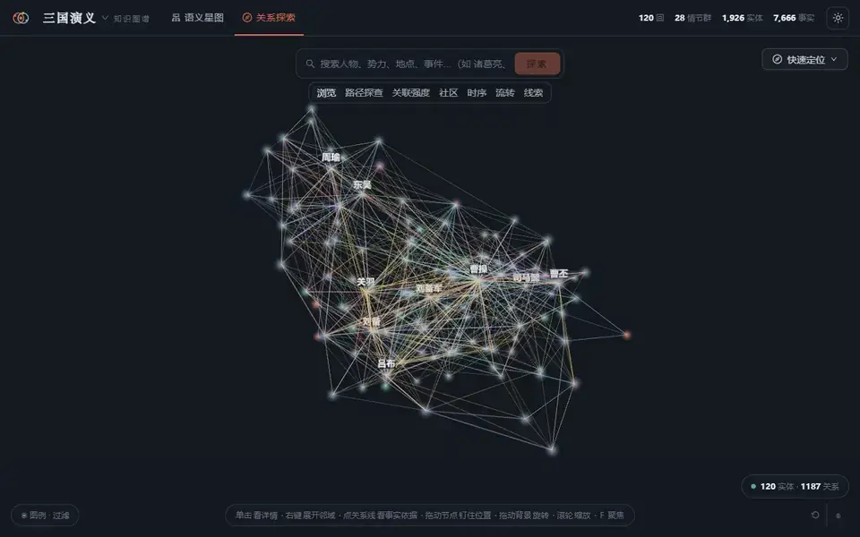
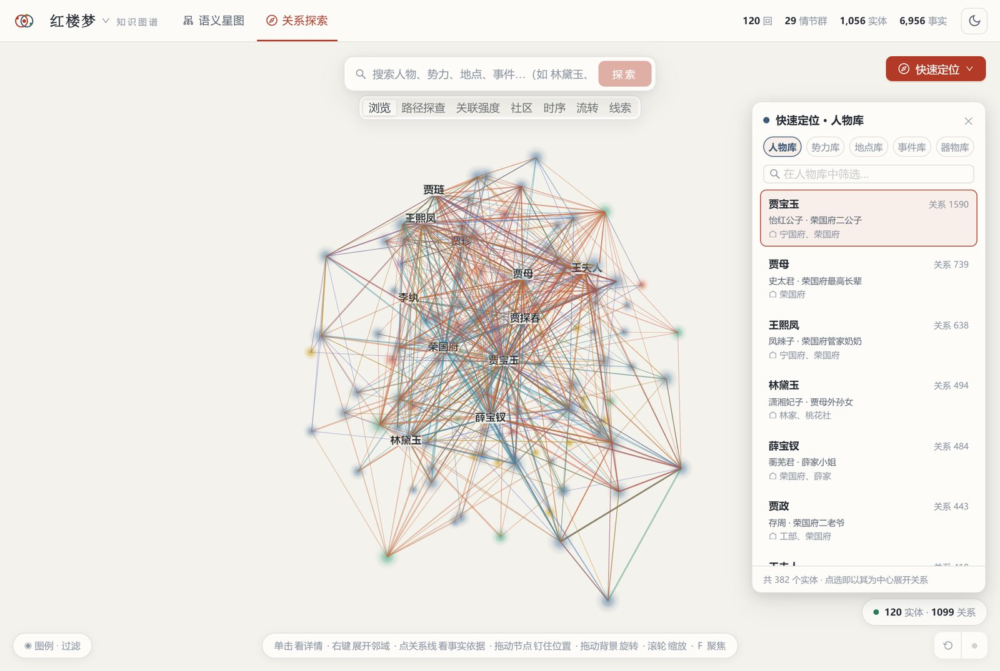
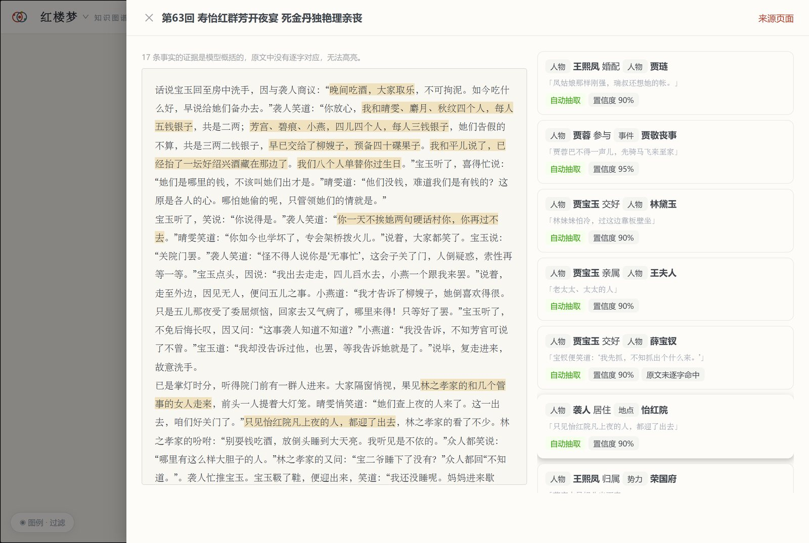
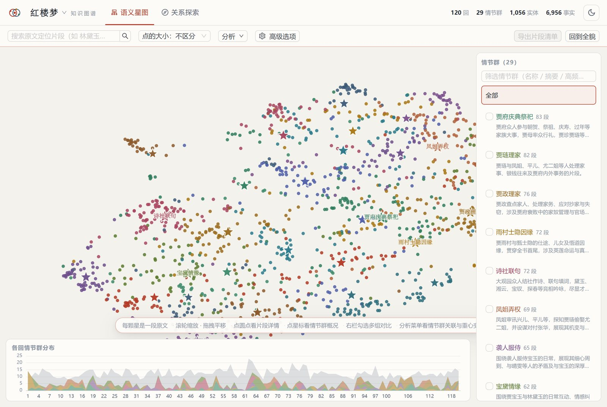
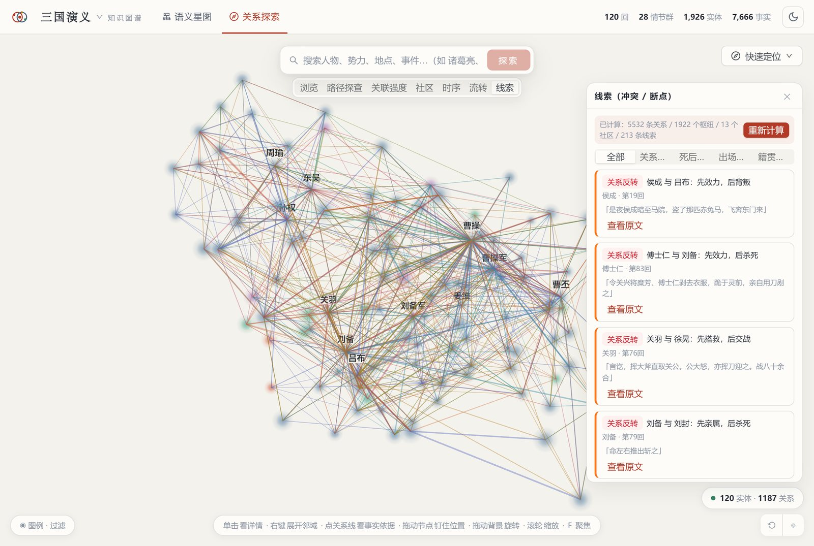
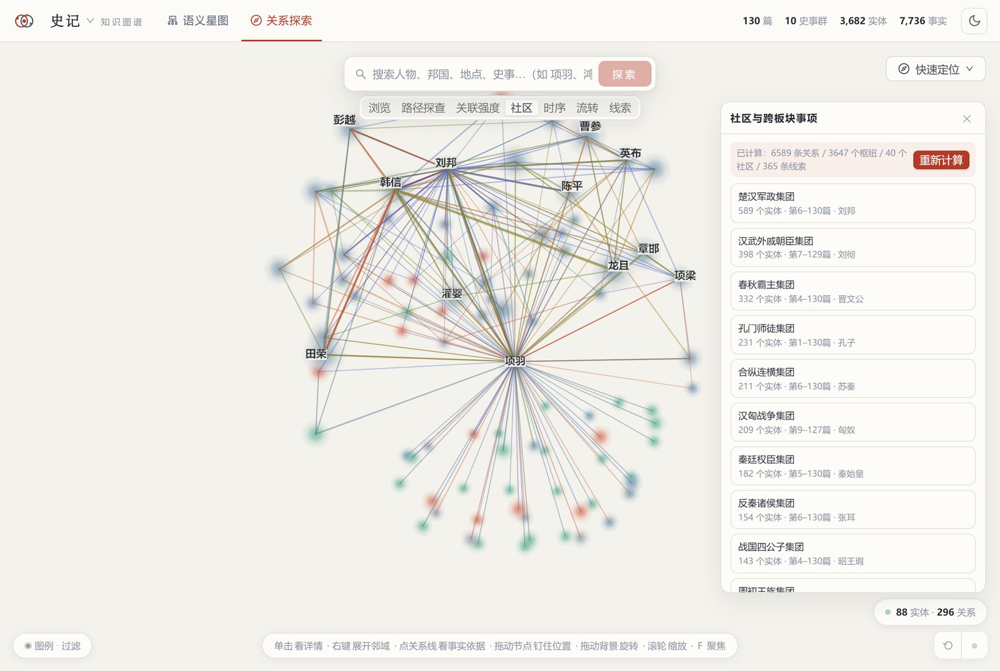
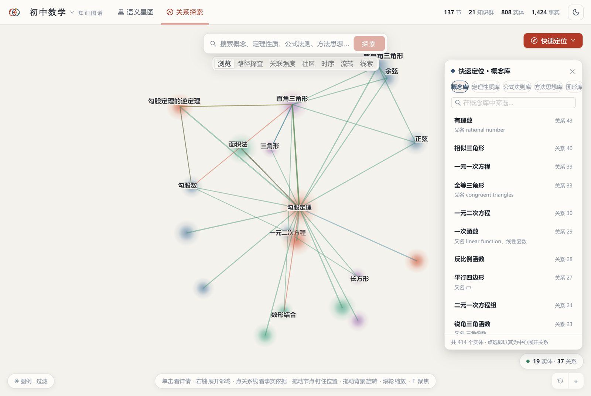
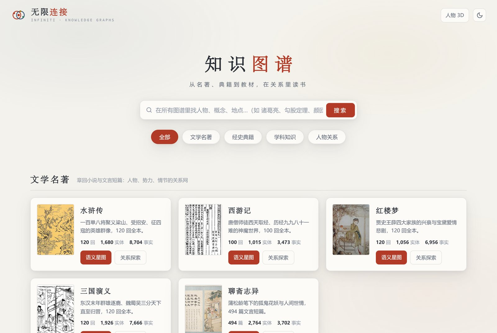

<div align="center">

# 无限连接 INFINITI

**关系式学习助手：读懂一本书，理清一门课**

AI 通读学习材料，把人物、概念和知识点连成可交互的关系图谱，每条关系都标明原文出处

已收录 8 份材料（四大名著 · 聊斋 · 论语 · 史记 · 初中数学），**13,036** 个条目，**39,938** 条关系

[](LICENSE)
[](https://github.com/sencloud/Infiniti/stargazers)


简体中文 | [English](README.en.md)



</div>

---

读《红楼梦》第三遍，还是分不清贾家谁是谁的谁？学到二次函数，想不起它建立在哪些知识点上？要啃一份陌生的技术文档，不知道从哪个概念入手？

**无限连接**是一款创新阅读与学习服务软件。它让大模型把学习材料从头到尾读一遍，抽出其中的人物、概念、事件和它们之间的关系，存进图数据库，再呈现成可以搜索、展开、点进去看原文的关系图谱。先看清全貌，再沿着关系一步步深入，每一步都能回到原文核对。

## 适用场景

| 场景 | 它能帮你做什么 | 现状 |
|------|--------------|------|
| **读一本书** | 理清人物关系和情节脉络，看清全书由哪些情节群组成，找出前后反转、断档等值得细读的地方 | 已收录四大名著、聊斋志异、论语、史记 |
| **学一门课** | 把知识点按「前置 → 定理 → 应用」连成网，看清每个知识点依赖什么、能推出什么，翻到教材原页 | 已收录初中数学（苏科版 6 册） |
| **学一门技术 · 准备一次考试** | 同一套管线可用于技术文档、教程、考纲、讲义：导入资料，生成你自己的学习图谱 | 需自行导入资料，见[添加学习材料](#添加学习材料) |

适合中小学生读名著、学课本，大学生和考研、考公、考证的备考者梳理材料，自学新技术的开发者和职场人，深度阅读的读者，以及备课、辅导的老师和家长。

## 怎么帮你学

<table>
<tr>
<td width="50%" valign="top">

### 关系探索：从一个点出发

搜「贾宝玉」，他身边 1,590 条关系立刻铺开。点人看身份和别称，点线看两人什么关系，右键继续向外展开。路径探查能回答「这两个人是怎么联系起来的」，时序和流转能看出关系随章节怎样变化。

</td>
<td width="50%"></td>
</tr>
<tr>
<td width="50%"></td>
<td width="50%" valign="top">

### 原文溯源：每个结论都能核对

点一条关系，直接跳到原文那一回，支撑这条关系的句子自动高亮，并标出抽取置信度。学到的东西都有出处可查，不是模型凭空编的；写读书笔记、做题引用时可以直接回到原文。

</td>
</tr>
<tr>
<td width="50%" valign="top">

### 语义星图：先见全貌

原文分段向量化后降维聚类，《红楼梦》120 回自动聚成 29 个情节群：诗社联句、凤姐弄权、宝黛情缘……底部能看到每个情节群在哪几回最密集。开始读一本书或复习一门课之前，先看清它由哪些部分组成。

</td>
<td width="50%"></td>
</tr>
<tr>
<td width="50%"></td>
<td width="50%" valign="top">

### 线索：找到值得细读的地方

按规则扫出「关系反转」「死后再现」「出场断档」「籍贯冲突」：侯成先效力吕布、后背叛；关羽和徐晃先是搭救、后来交战。《三国演义》一本就找出 213 条，读书笔记和阅读题的素材直接就有了。

</td>
</tr>
<tr>
<td width="50%" valign="top">

### 社区：把散落的内容归成组

Louvain 社区发现自动划出人物集团或知识模块。《史记》3,682 个条目分成楚汉军政、汉武外戚朝臣、春秋霸主、孔门师徒等 40 个集团，散在 130 篇里的人物互见一下子串了起来。

</td>
<td width="50%"></td>
</tr>
<tr>
<td width="50%"></td>
<td width="50%" valign="top">

### 知识网：学课程、做复习

初中数学 6 册 137 节，知识点按前置、推导、应用连成网。点「勾股定理」能看到它依赖什么、能推出什么，还能直接翻到教材原页。教材另有一套线索规则：前置倒挂、循环依赖、孤立知识点、跨册长跳，复习时可以据此查漏补缺。

</td>
</tr>
</table>

另外还支持亮色 / 暗色主题和手机浏览。

## 已收录的学习材料



| 材料 | 单元 | 条目 | 关系 | 情节群 / 知识群 |
|------|-----:|-----:|-----:|-----:|
| 水浒传 | 120 回 | 1,680 | 8,704 | 29 |
| 西游记 | 100 回 | 1,015 | 3,473 | 9 |
| 红楼梦 | 120 回 | 1,056 | 6,956 | 29 |
| 三国演义 | 120 回 | 1,926 | 7,666 | 28 |
| 聊斋志异 | 494 篇 | 2,764 | 3,702 | 30 |
| 论语 | 20 篇 | 105 | 277 | 10 |
| 史记 | 130 篇 | 3,682 | 7,736 | 10 |
| 初中数学（苏科版 6 册） | 137 节 | 808 | 1,424 | 21 |

想学哪本书、哪门课？欢迎在 [Issues](https://github.com/sencloud/Infiniti/issues) 里提，或者照着下面的[添加学习材料](#添加学习材料)自己生成。

## 快速开始

需要 Node.js 20+、Docker（运行 Neo4j）和一个 [DeepSeek API Key](https://platform.deepseek.com/)。

```bash
git clone https://github.com/sencloud/Infiniti.git
cd Infiniti

# Windows 一键启动：装依赖、构建前端、启动 Neo4j + Web + Worker、打开浏览器
start.bat
```

或者手动：

```bash
docker compose up -d                  # Neo4j
npm install
npx playwright-core install chromium  # 真浏览器抓取内核
cp .env.example .env                  # 填入 DEEPSEEK_API_KEY
npm --prefix web install && npm run web:build

npm start                             # Web 服务 http://localhost:3100
npm run worker                        # 数据管道（另开终端）
```

新 clone 的数据库是空的。仓库里已经带了 8 部书的原文和大模型抽取结果，一条命令就能把它们全部入库并算好星图和关系分析，不用重新抽取：

```bash
npm run kg:restore                    # 全部图谱；也可以只恢复一部：npm run kg:restore -- hongloumeng
```

## 添加学习材料

一本书、一套教材、一份技术文档或考试讲义，都走同一条管线：抓取 → 种子 → 抽取 → 入库 → 星图与关系分析，每步可续跑。

1. 在 `src/kg/domains/index.js` 里加一份材料配置：名称、来源网址、单元（回 / 篇 / 节 / 章）、实体类型（人物、概念、定理、术语……）、关系谓词、线索规则
2. 运行 `npm run kg:run -- <材料id>`
3. 打开首页，卡片会显示构建进度，完成后即可学习

[5000言](https://www.5000yan.com/) 上的古籍基本换个网址就能直接生成；教材类可以参照初中数学的配置（`math`），把知识点、前置关系和教材原页对应起来。

如果只是想快速了解某个人物或主题，首页的「自由探索」可以直接输入名字，系统会从百科抓取资料并自动生成图谱。

---

## 技术细节

### 系统架构

```
┌──────────────────────────────────────────────────────────┐
│          前端（Vite + React + antd / Three.js 3D）         │
│    学习材料首页 · 语义星图 · 关系探索 · 原文溯源 · 自由探索    │
└──────────────────────────┬───────────────────────────────┘
                           │ REST API
┌──────────────────────────┴───────────────────────────────┐
│                   Express 服务层（src/）                   │
│      routes.js · kg/routes.js · *Query.js · services/      │
└───────┬──────────────────────────────────┬───────────────┘
        │ 写入                              │ 读取
┌───────┴──────────────┐          ┌────────┴──────────────┐
│  管线 / Worker        │          │       Neo4j           │
│  crawler（多源降级）  │─────────▶│  Entity/Claim/Segment │
│  extract（DeepSeek）  │          │  Cluster/Community/…  │
│  galaxy / analysis    │          │  Person/Event/Topic   │
└──────────────────────┘          └───────────────────────┘
```

### 多图谱（语义星图 / 关系探索）

库里每个节点带 `graph_id`，各图谱互不干扰；图谱配置（实体类型、谓词、单元名称、线索规则、分类）在 `src/kg/domains/index.js`。

| 图谱 | id | 来源 |
|------|----|------|
| 水浒传 | `shuihu` | [5000言](https://shuihu.5000yan.com/) |
| 西游记 / 红楼梦 / 三国演义 | `xiyouji` / `hongloumeng` / `sanguo` | 5000言 |
| 聊斋志异 | `liaozhai` | 5000言 |
| 论语 / 史记 | `lunyu` / `shiji` | 5000言 |
| 初中数学 | `math` | [国家中小学智慧教育平台](https://basic.smartedu.cn/) 苏科版 6 册 |

- **语义星图**：原文分段向量化（本地 bge-small-zh）→ PCA + UMAP → KMeans 聚成情节群 / 知识簇，DeepSeek 命名；子群、跨群关联、离群段、分期漂移、按实体检索，点任意一段看原文高亮。
- **关系探索**：实体关系 3D 图（Y 轴为章回 / 节）；浏览、路径探查、关联强度、社区、时序台账、流转、线索。
  线索规则按图谱类型选：小说 / 史传用 R1–R4（关系反转 / 死后再现 / 出场断档 / 籍贯冲突），
  教材用 M1–M4（前置倒挂 / 循环依赖 / 孤立知识点 / 跨册长跳）。
- **媒体**（水浒传）：维基共享资源的公有领域古画 + 百科配图（节点卡图集，注明出处和许可），
  央视 1998 版 43 集与回目的对应表（节点卡和原文抽屉里点集数，弹窗播放 B 站外链）。
- **教材原页**（初中数学）：原文抽屉按页显示教材页码，可切到页面原图。

页面路径：首页 `/`，每个图谱有语义星图 `/g/<图谱>/galaxy` 和关系探索 `/g/<图谱>/explore` 两个视图。旧地址 `/kg/*` 会跳到 `/g/shuihu/*`。

### 数据生成

```bash
npm run kg:run -- <图谱>                 # 全流程，如 npm run kg:run -- xiyouji
npm run kg:run -- <图谱> load build      # 只跑指定步骤
npm run classics:all                     # 后台批量跑 5000言 的名著与典籍（失败的会串行重试一次）
npm run math:fetch                       # 数学：下载教材页图，deepseek-flash 识图转写，按目录切节
npm run math:all                         # 数学全流程（抓取步骤即 math:fetch，转写有缓存）
npm run shuihu:media                     # 水浒人物图片 + 央视版分集表，写入 Entity.media
npm run kg:covers                        # 首页封面（维基数据的公有领域书影）→ data/covers/
```

进度写到 `data/<图谱>/status.json`，首页卡片据此显示构建进度。入库只清当前图谱的节点。抽取结果缓存在 `data/<图谱>/extract/`，重跑 load / build 不再调用模型抽取（星图命名仍会调用 DeepSeek）。
向量文件、教材页图、水浒图片不入库，clone 后分别由 `kg:run -- <图谱> load build`、`math:fetch`、`shuihu:media` 重新生成。页面上的「重新计算」按钮等价于 build 的对应阶段。

教材 PDF 需要登录，管线改用平台公开的逐页图片，由 `DEEPSEEK_VISION_MODEL`（默认 `deepseek-flash`）识图转写，结果缓存在 `data/math/ocr/<册>/<页>.md`，页图在 `data/math/media/`。

### 前端

前端是独立的 Vite + React + antd 子工程（`web/`），构建产物输出到 `public/app/`（已 gitignore），由 Express 托管：

```bash
npm --prefix web install
npm run web:build        # 生成 public/app/
npm run web:dev          # 开发模式（http://localhost:5173，/api 和 /media 代理到 3100）
```

### 自由探索（任意人物 / 学习主题自动构建）

除了按材料构建，首页「自由探索」（`/people/`）可以输入任意人物或学习主题，系统自动规划、多源抓取、LLM 抽取，在 3D 时间图谱上无限生长：

- 输入「苏轼」：沿人际关系网络向外扩展
- 输入「小学数学3年级」：自动拆解课程单元、抓取知识点、构建学科图谱
- 已有的直接跳转；没有的可选择「抓取人物资料」或「自动构建知识图谱」
- 队列面板（右下角）管理任务，⚙ 配置面板（右上角）设置数据源库 / 构建规模 / LLM 模型

**本体**（`src/ontology.js`）

| 实体 | 说明 | 3D 呈现 |
|------|------|--------|
| `Person` | 人物（生卒年/职业） | 球体，按家族姓氏着色 |
| `Event` | 事件（年份/类别） | 金色八面体 ◆ |
| `Topic` | 知识主题（学科/单元/概念） | 绿色立方体 |

关系（`RELATES.type` 受控词表）：

- **人—人**：亲属 / 配偶 / 师生 / 同事 / 朋友 / 竞争对手 等 14 类
- **人—事件**：参与 / 主持 / 发起 / 组织 / 涉及 / 牵连
- **知识—知识**：包含 / 前置 / 属于 / 应用 / 相关

**数据管道**：任务带 `kind` 字段，两条流水线。

```
人物流程（kind: person）
取任务 → 抓取百科 → DeepSeek 抽取(属性+关系+事件) → 消歧 → 入库
     → 关系人入队（亲缘优先）→ 事件参与者入队

知识流程（kind: knowledge，三阶段）
plan     LLM 规划：主题 → 单元(8~15) → 概念(每单元3~6)
unit     单元展开：概念任务入队
concept  多源抓取 → 通用知识抽取 → Topic 节点 + 知识边 → 相关概念入队
```

**数据源库**（`src/sources/registry.js`）：内置百度百科（优先级 100）和中文维基百科（80），按优先级依次尝试，失败自动降级。自定义源可在配置面板添加（存 Neo4j，热加载）。所有源共用真浏览器抓取内核（Playwright），自带 JS 反爬能力。

**3D 交互**

| 操作 | 效果 |
|------|------|
| 单击节点 | 聚焦：只显示该节点及其直接关系，其余隐藏 |
| 双击节点 | 展开邻域（无限生长） |
| 拖动 | 旋转视角（左键）/ 平移（右键） |
| 滚轮 | 缩放 |
| 左侧时间轴 | 拖动手柄缩放年代范围 |
| 图例 | 点击关系类型行，隐藏/显示对应节点和边 |
| `Esc` | 退出聚焦 |

Y 轴是时间地层（人物按出生年、事件按发生年分层，唐代在上、清代在下），X/Z 平面是力导向布局（同代 / 同主题自然聚拢）。

<details>
<summary>API 概览（人物图谱）</summary>

| 方法 | 路径 | 说明 |
|------|------|------|
| GET | `/api/stats` | 全库统计 |
| GET | `/api/search?q=` | 搜索（人物/事件/主题） |
| GET | `/api/graph/:key` | 实体邻域子图 |
| GET | `/api/person/:key` | 实体详情 |
| POST | `/api/seed` | 添加种子人物 |
| POST | `/api/topics` | 构建知识主题（plan 阶段入队） |
| GET/POST | `/api/tasks` | 任务列表 / 添加任务 |
| DELETE | `/api/tasks/:name` | 删除任务 |
| POST | `/api/tasks/:name/retry` | 重试任务 |
| PUT | `/api/tasks/:name/priority` | 调整优先级 |
| DELETE | `/api/tasks?status=` | 清空某状态任务 |
| POST | `/api/purge` | 清理孤立节点 |
| GET/POST | `/api/sources` | 数据源列表 / 添加 |
| DELETE | `/api/sources/:id` | 删除自定义源 |
| GET/POST | `/api/settings` | 系统配置读写 |

多图谱接口在 `/api/knowledge-graph/*`（`?graph=<id>`），见 `src/kg/routes.js`。

</details>

### 项目结构

```
src/
├── server.js               # Web 入口
├── routes.js               # 人物图谱 API
├── db.js                   # Neo4j 驱动 + Schema
├── config.js               # 环境变量配置
├── ontology.js             # 本体定义（实体/关系词表）
├── sources/registry.js     # 数据源注册表
├── services/               # 图写入 / 图查询 / 系统配置
├── pipeline/               # 多源抓取（真浏览器）、DeepSeek 抽取、Worker 主循环
├── kg/                     # 多图谱后端（/api/knowledge-graph/*，?graph=<id>）
│   ├── domains/index.js    # 图谱配置：分类、实体类型、谓词、单元名、线索规则
│   ├── galaxyBuild.js      # 向量化 + PCA/UMAP/KMeans + 命名 + 关联/子群/离群/漂移
│   ├── analysisBuild.js    # 关联强度 / Louvain 社区 / 枢纽 / 线索规则（R1–R4 / M1–M4）
│   └── *Query.js           # 星图 / 探索 / 分析查询
└── scripts/
    ├── seed.js             # 种子脚本
    ├── kg/                 # 通用管线（crawl / seeds / extract / load / build / run / all / covers / wikimedia）
    ├── math/fetch.js       # 教材页图下载 + 识图转写 + 按目录切节
    └── shuihu/             # 水浒专用：一百单八将词典、人物图片与分集表
public/people/              # 自由探索：任意人物 / 主题的 3D 时间图谱（index.html + app-3d.js）
web/                        # 首页 + 语义星图 + 关系探索前端（Vite + React + antd）
data/<图谱>/                # 原文、抽取缓存、status.json、媒体（/media/<图谱>/…）
```

### 配置说明（.env）

```ini
PORT=3100                          # Web 端口
NEO4J_URI=bolt://localhost:7687    # 数据库
NEO4J_USER=neo4j
NEO4J_PASSWORD=infiniti123
DEEPSEEK_API_KEY=sk-xxx            # 必填
DEEPSEEK_BASE_URL=https://api.deepseek.com
DEEPSEEK_MODEL=deepseek-chat
DEEPSEEK_VISION_MODEL=deepseek-flash  # 教材页图转写（需多模态）
MATH_OCR_PARALLEL=6                # 转写并发
MAX_PERSONS=500                    # 构建规模上限
MAX_DEPTH=6                        # 探索深度上限
CRAWL_DELAY_MS=2000                # 抓取限速（对源友好）
```

面板保存的配置存 Neo4j，重启 worker 后覆盖 `.env` 默认值。

### 技术栈

- **后端**：Node.js 20 + Express 5
- **数据库**：Neo4j 5（Cypher + 向量索引）
- **抽取**：DeepSeek（OpenAI 兼容接口）
- **分析**：bge-small-zh 本地向量、UMAP、KMeans、Louvain（graphology）
- **抓取**：Playwright 无头浏览器（多源降级）
- **前端**：Vite + React + antd；Three.js 3D（手写力导向，无图库依赖）

## 许可

代码以 [MIT](LICENSE) 协议开源。

数据说明：古籍原文来自 [5000言](https://www.5000yan.com/)，属公有领域；水浒人物古画来自维基共享资源，节点卡上注明了出处和许可；初中数学教材的页图和转写版权归出版社所有，仅供学习研究，请勿大量转载或商用。抓取时请遵守各数据源的使用条款，并保持限速。

## 参与

欢迎提 Issue 和 PR：想学的书和课程、新的材料配置（技术文档、考试讲义等）、发现的抽取错误、新的线索规则、UI 改进都可以。如果这个项目对你有帮助，点个 Star 让更多人看到它。
